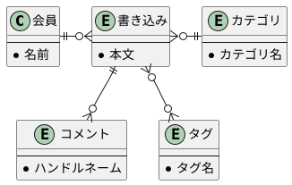
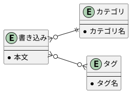
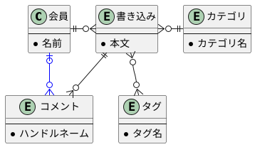
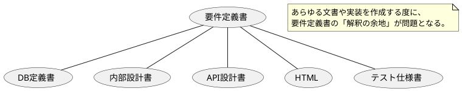
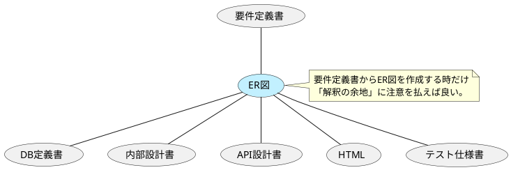

## TL;DR

* リレーショナルモデルの知識はDBエンジニアだけのものではない。
* 要件定義やサーバ実装、フロントやAPI開発にも大いに役立つ。
* 開発に携わる誰しも、ER図を通じて知見を共有してみよう。





問題意識や課題、リレーショナルモデルの知識は何を解決してくれるのか、本記事ではこれらを簡単なER図の読み方を交え解説していく。

## 自然言語で要件を共有する難しさ

例えばこんな要件があったとする。

* ユーザーが書き込みを行う。
* 書き込みには「タグ」「カテゴリ」を付与できる。
* 書き込みには誰でもコメントができる。

要は掲示板だ。Web開発の経験者ならお手のものだろう。

だがこのままではおそらく開発は難しい。上の要件からは必要な情報を抜いてある、それらのいくつかを太字で追加する。

* **会員** が書き込みを行う。
  * 書き込みを行えるのは **会員のみ** 。
* 書き込みには「タグ」「カテゴリ」を付与できる。
  * カテゴリは **1つだけ** 付与できる。カテゴリの付与は **必須** 。
  * タグは **何個でも** 付与できる。タグの付与は **任意** 。
* 書き込みには誰でもコメントができる。
  * コメントは **誰でも** 投稿可能。
  * コメントの際は **ハンドルネーム** を一緒に入力する。

どれだけ絞ってもこの文章量が必要だが、さほど難しくもないこれらの「要件」を正確に共有するのが思いのほか難しいことは、ある程度以上の規模の開発に携わったことのある方なら誰しも知っているはずだ。

## ER図による簡潔かつ正確な表現

実は上の要件は次のER図で全て正確に表現されている。

* **線の繋がり** 。「書き込み」には「会員（投稿主）」「カテゴリ」「コメント」「タグ」と言った情報が付随することが解る。
* 「会員」「コメント」の間には **線が無い** 。「コメント」には「会員」の情報は付与されない、つまり会員でなくともコメント可能と解る。

「書き込み」「カテゴリ」「タグ」を抜粋し注目してみる。

線の端の記号が非常に重要だ。「カテゴリ」と「タグ」とで記号が異なることに特に注目したい。

* 線の端の3本の枝分かれ（ `∋` や `∈` ）は「複数」を意味する。 
* 枝分かれせず交差する外側の線 （ `+` ）は「単一」を意味する。
* その内側の記号（ `+` や `φ` ）はそれぞれ「1個」「0 or 1個」を意味する。

記号の意味を踏まえて線の繋がりを見れば、

> * カテゴリは **1つだけ** 付与できる。カテゴリの付与は **必須** 。
> * タグは **何個でも** 付与できる。タグの付与は **任意** 。

冒頭の要件は上の簡単な図で全て示されているることが解るだろう。

更に言うと **1件も書き込みが存在しない状態でもタグやカテゴリは存在できる** ことも図から見て取れる。タグやカテゴリの作成UIは書き込みフォーム上のコンボボックスだけでなく「カテゴリ作成画面」「タグ作成画面」と言った専用の方法がおそらく必要であることもER図から読み取れる。

せっかくなのでもう少し、ER図の読み方に慣れてみたい。

* コメントは誰でも投稿可能。
* コメントの際はハンドルネームを一緒に入力する。
* **会員が投稿した場合、ハンドルネームに加え投稿した会員情報も保持される**

太字の要件を追記したが、この場合ER図は次のようになる。青い線が追加部分だ。

「会員」と「コメント」の間に線が引かれた。「コメント」が「会員」の情報を持てることが示された一方「会員」側の内側の記号は `φ` すなわち「0 or 1個」つまり任意、ということだ。



もう少し慣れてみたい方は、たとえば次のような仕様だった場合ER図はどのように変わるか考えてみて欲しい。

* [前略プロフィール](https://ja.wikipedia.org/wiki/%E5%89%8D%E7%95%A5%E3%83%97%E3%83%AD%E3%83%95%E3%82%A3%E3%83%BC%E3%83%AB) のような、1名の会員は1個の書き込みだけを持つようなサービス。
  * 会員登録時に必須でプロフィールを作成しなければならないケース
  * プロフィールの作成は後からでも良いケース

何れも線の繋がりは変わらない。端の記号を変えるだけで表現可能だ。



文章による表現では書く側も読む側もとかく気を遣う仕様も線と記号だけで正確に表現可能、これがER図の真髄だ。

## 要件を共有することの難しさ

冒頭にあるような自然言語の要件は、開発に関わるおそらく全員が何らかの形で正確に把握する必要がある。

繰り返すが「全員」だ。DBエンジニアだけでなくサーバサイドエンジニアはもちろんHTMLコーダーやQAエンジニアまで含む。具体的には次のような判断に使われる。

* DBエンジニア
  * テーブルや外部キー制約、それぞれのデータの正規化の適否。
* サーバサイドエンジニア
  * ORMの実装。`BelogsTo` なのか `HasOne` なのか `MasMany`か、はたまた `BelongsToMany` なのか。
  * APIが返却すべき型は `tag: string` なのか `tag: string|null` なのか `tags: Array<string>` なのか。
* フロントエンドエンジニア
  * コンポーネントが受け入れるべき値はスカラーなのか配列なのかオブジェクトなのか。
* デザイナー、画面設計担当
  * 表示すべき入力項目とそれぞれ必須任意、複数入力の要否。それらの段組みやレイアウトへの影響。
* HTMLコーダー
  * マークアップ。 `div` なのか、`ul>li*` / `ol>li*` なのか `dl>(dt+dd)*` なのか
* QAエンジニア
  * ブラックボックステストのテストケースを境界値分析で作成する際、0件やn件を考慮するか。

冒頭のさほど難しくもない文章も、これだけの分量の文書や実装に利用されることを考えると「正確な共有」が至難の業なのは頷ける。

## ER図による共有コストの削減

ここで仕様書やコードと要件定義書の関係を図に表してみよう。

「要件定義書」から様々な仕様書やコードが作成されるが、御存知の通り「要件」は往々にして変わる。自然言語で書かれ自然言語で変更されるこの「要件」をあますことなく正確に共有するために、次のようなフローを考えてみたい。

「ER図」を認識共有用のメタ言語として使うことで齟齬の発生を抑えるのが狙いだ。ER図はあくまで表現方法（手段）でしかないが、データの繋がりや関係性を正確に伝える手段を持つことで認識齟齬や手戻りの少ない開発を行える効果が期待できる。

## ER図やリレーショナルモデルを学習するコスト

冒頭に *DBエンジニアだけのものではない* とわざわざ書かなければならない通り、ER図やリレーショナルモデルは必ずしも万人が使いこなせるツールであると言い難い。 *HTMLコーダー* と例を挙げはしたが、現実的にはまだハードルは高いだろう。

一方で最近は [PlantUML](https://plantuml.com/) に代表されるUML作図ツールも導入が楽になり使い勝手も良くなってきた。便利なツールでまずは作図にチャレンジしてみるのは学びの入り口として最適だ。

入門者の入り口位となりそうな身近な利用例を列挙したい。

* Qiitaへの投稿
  https://qiita.com/Qiita/items/c686397e4a0f4f11683d#plantuml%E3%82%92%E4%BD%BF%E3%81%86
* Visual Studio Code での編集とプレビュー
  * https://marketplace.visualstudio.com/items?itemName=jebbs.plantuml
  * ネットを検索するとJavaのインストールを必要とする気が見つかるが、最近のバージョンはインストールなしでも動く。
* この記事の [ソースコード](https://github.com/KentarouTakeda/blog/blob/master/source/_posts/2022-08-01-want-ERD-to-become-more-popular.md)
  * 本記事ではER図以外も含む全て図をPlantUMLで作図した。

一昔前よりも敷居は低くなっていると感じる。思い立ってこのブログをPlantUMLのレンダリングに対応した際も [コマンド一発](https://www.npmjs.com/package/hexo-filter-plantuml) で完了した。

リレーショナルモデルを制する者はアプリケーション開発の全てを制する。みなさん、良きER図ライフを。
