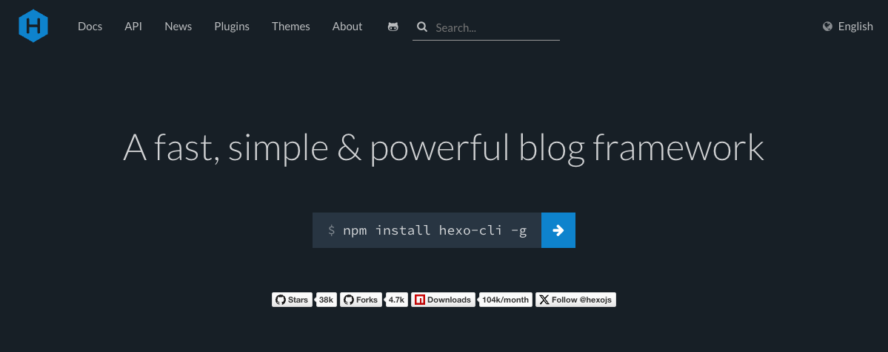
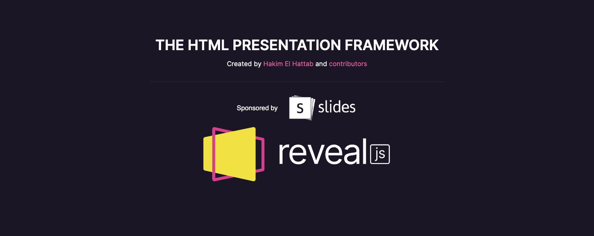

## Hexo Reveal Embed

---

#### [Hexo](https://hexo.io/) - 静的サイトジェネレータ

1. Markdownで記事を執筆
2. ローカル環境プレビュー
3. ローカル or CI でhtmlを生成
4. GitHub PagesやS3へデプロイ



---

#### [reveal.js](https://revealjs.com/) - スライド作成ツール

1. HTML or Markdown でスライド執筆
2. ツールやVSCode拡張でプレビュー
3. **[reveal.js API](https://revealjs.com/initialization/)でスライド表示をサイトへ実装**
4. デプロイ



---

#### [Hexo Reveal Embed](https://www.npmjs.com/package/hexo-reveal-embed)

\> **reveal.js APIでスライド表示をサイトへ実装**

*Hexoからreveal.jsのAPI利用し  
ブログ記事にスライド表示するライブラリ*

---

#### インストール

> npm install hexo-reveal-embed

* Hexo 6 or later
* Node.js 18.0 or later

---

#### 設定（任意）

`_config.yml`

```yaml
# このブログでの設定例
reveal:

  # reveal.js plugins to load
  plugins:
    - RevealHighlight # シンタックスハイライトを利用

  # reveal.js configuration
  config:
    hash: true # スライドページでURLハッシュを利用
    help: false # ヘルプ表示を無効化
    overview: false # スライド一覧表示を無効化
    transition: none # スライド遷移アニメーションを無効化
```

---

#### 記事とスライドを作成

*ディレクトリ構成*

```txt
source
├─ _posts
│  └─ 2024-01-13-introduce-hexo-reveal-embed.md # 記事
└─ _slides
   └─ 2024-01-13-introduce-hexo-reveal-embed
      ├─ index.md                               # スライド
      ├─ hexo.webp
      └─ revealjs.webp
```

*記事へのスライド埋め込み*

```nunjucks

```

---

#### 埋め込みデザインの調整

Hexo Reveal Embedはcssを提供していない

*css実装例:*

```css [1-7|9-15]
/* 16:9のスライドを横幅100%で埋め込み表示 */
.hexo-reveal-embed {
  width: 100%;
  height: 0;
  padding-top: 56.25%;
  position: relative;
}

/* iframeをスライド領域いっぱいに表示 */
.hexo-reveal-embed iframe {
  height: 100%;
  position: absolute;
  top: 0;
  width: 100%;
}
```

---

#### Enjoy!

> npm install hexo-reveal-embed
