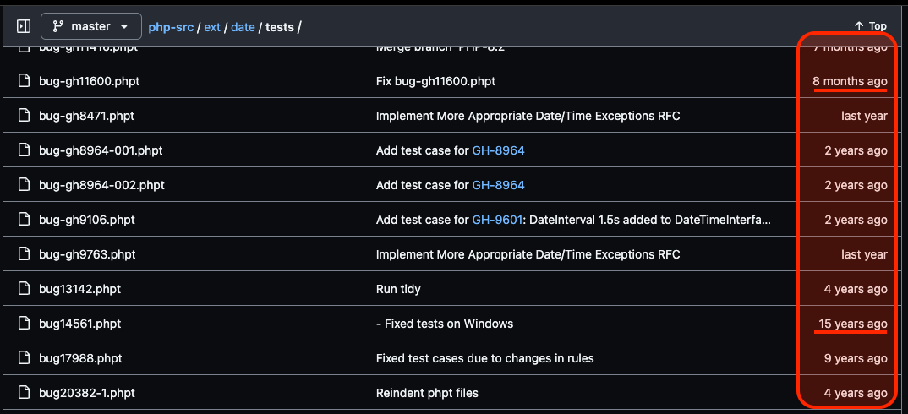

<!-- textlint-disable -->

### php-srcは<br>あなたのコントリビューションを<br>求めています

#### or: php-srcでphpのスキルアップをする方法

---

## 自己紹介

* 武田 憲太郎 / [@KentarouTakeda](https://twitter.com/KentarouTakeda)

* PHP歴20年

* C歴2年 - ただし30年前  
  **今は何も書けない**

* php-srcコントリビューター  
  **何度も言うがCは書けない**

---

### php-srcは<br>あなたのコントリビューションを<br>求めています

---

#### [PHPの開発に貢献する4つの方法](https://speakerdeck.com/matsuo_atsushi/phpcon-hokkaido-cybozu-lt-202401) by [@cybozuinsideout](https://twitter.com/cybozuinsideout) 松尾 篤

1. PHPの[RC版](https://qa.php.net/)や[リリース版](https://www.php.net/releases/)でテストを実行する
2. 失敗するテストが見つかった場合にはその内容を診断する(詳細 は[phptのドキュメント](https://qa.php.net/write-test.php)を参照)
3. [GitHub Issues](https://github.com/php/php-src/issues)で不具合の登録や修正を行う
4. GitHubにある[doc-*リポジトリ](https://github.com/php/?q=doc)でドキュメントの保守や翻訳を手伝う(詳細は[PHP Manual Contribution Guide](http://doc.php.net/tutorial/)を参照)

https://php.net/get-involved より  

---

PHPでプログラムを書いているPHPerにとって、  
最も距離が近いのはテストでの貢献

---

### phpのテストの書き方

```php [1-2|3-11|12-18]
--TEST--
Test Fizz Buzz Function
--FILE--
<?php
var_dump(fizz_buzz(10));
var_dump(fizz_buzz(11));
var_dump(fizz_buzz(12));
var_dump(fizz_buzz(13));
var_dump(fizz_buzz(14));
var_dump(fizz_buzz(15));

--EXPECT--
string(4) "Buzz"
int(11)
string(4) "Fizz"
int(13)
int(14)
string(8) "FizzBuzz"
```

`*.phpt` ファイルにテストが書かれている。

---

### phpのテストの書き方

* `--TEST--`  
  テストの名前
* `--FILE--`  
  ここにphpスクリプトとしてテストを実装
* `--EXPECT--`  
  このブロックとテストの出力とが比較される

PHPのテストはPHPで書かれている。

---

### 筆者の考えるphp-srcへの貢献の方法

* PHPの開発版でテストを実行する。

* 失敗するテストが見つかった場合、  
  **調査および修正**する。

* 失敗するテストでなくとも、  
  **テストの範囲や設計、実装を改善**する。

---

### php-srcのテストを取り巻く状況



* 十数年前のテストと最近とが同列に並ぶ。
* それら全てのオールパスを維持。

---

### PHP開発者にとっての障壁

* 品質の基準が今と異なるテスト
  * 不十分なカバレッジ
  * エラー制御演算子 `@` の多用
* 十数年前の書き方のphpコード
  * 冗長なコード
* 当時と今とで実行条件の異なるテスト
  * CIの設定に依存したテスト
  * 特定の環境でしか実行されないテスト
  * 偽陰性（⁠false negative）テスト

**これらが時に、PHP開発者にとって<br><u>大きな障壁</u>になっている。**

<!-- 実務に置き換えて考えてみるよう語りかける。現実のプロジェクトでも同じことを経験した人は多いはず。 -->

---

#### ~~php-srcでphpのスキルアップをする方法~~

#### テストコードの改善で<br>phpのスキルアップをする方法

---

### phptで書くPHPのテストコード

1ファイル1テストスイートを基本とする<br>シンプルな構成

* テストの性質上、高度な機能を避けた実装が求められる。

* 何らかの共通化を行う場合も `require()` が限度。

**特定のフレームワークに依存しない<br><u>純粋な</u>PHP力が求められる。**

---

### phptで書くPHPのテストコード

入力（PHPコード・関数への入力）に対し<br>出力（標準出力）を検証

* 競技プログラミングやプログラミング学習サイトでよく見る形式。

* テストとして（＆プログラムとして）最も基本的な形式。

**特定の言語に依存しない<br><u>純粋な</u>実装力が求められる。**

---

### 目的のコードの探し方

https://www.php.net/manual/ja/mbstring.installation.php

> <u>mbstring</u>は拡張<u>モジュール</u>です。

* PHPマニュアル（主に「インストール手順」）からモジュール名を特定

---

### テスト格納ディレクトリ

* マルチバイト文字列のテスト  
  [php/php-src/ext/mbstring/tests](https://github.com/php/php-src/tree/master/ext/mbstring/tests)

* 任意のモジュールのテスト  
  php/php-src/ext/モジュール名/tests

---

### テストファイル名

* `[機能名].phpt`
  * 特定の機能に対応

* `gh999999.phpt`
  * GitHubのIssue番号に対応
  * Issueを読めばテストの対象がわかる

* `bug999999.phpt`
  * [PHP Bug Tracking System](https://bugs.php.net/) のチケットに対応

---

### PHPを「発見」する

1. 好きな機能を1つ選んでください。

2. テストを1時間ほど読み進めてください。
   * IssueやBugに対するテストの場合、元のチケットも読んでください。

3. 直したくなる箇所がすぐに見つかります。
   * 或いは、あなたの知らなかったPHPの使い方が見つかります。
   * 或いは、Issueやプルリクエストの情報より様々な「理由」が見つかります。

---

### ビルド環境の構築

* [ウキウキ手作りミニマリストPHP](https://fortee.jp/phperkaigi-2024/proposal/9cb5ad60-8970-4877-894e-9a59826f20e1) by [@uzulla](https://twitter.com/uzulla)

  * 前半で、基本を網羅的に学べる。

  * 後半で、より高度な知識へ入門できる。

* [KentarouTakeda/docker-php-src](https://github.com/KentarouTakeda/docker-php-src) by [筆者](https://twitter.com/KentarouTakeda)

  * 筆者が個人的に使っているビルド環境。

  * READMEの通り構築すれば外部データベース含む一通りの環境が揃う。

---

### テストの実行

`./run-tests.php [phptファイル or ディレクトリ]`

---

### 基本を学ぶ

* [Building PHP — PHP Internals Book](https://www.phpinternalsbook.com/php7/build_system/building_php.html)
  * PHPのビルドに関する公式リソース
  * 内容が少し古い（バージョンは最新に読み替え）

* [Running the test suite — PHP Internals Book](https://www.phpinternalsbook.com/tests/running_the_test_suite.html)
  * PHPのテストに関する公式リソース

---

## まとめ

#### 何故 コントリビューションは 難しいか？

---

## [APIファーストの世界](https://api-first-world.com/ja/)


---

## [APIファーストの世界](https://api-first-world.com/ja/)

> この数十年、コンピューティングの世界では、<u>段階的に高次の抽象化を実現</u>するための技術開発に力が注がれてきたんだ

---

## 貢献の難しさ

* 抽象化される側とする側とでは、<u>課題領域</u>が異なる。
* 使う側と作る側では、<u>視点</u>が異なる。
* 自分が持っている知識だけでは、<u>文脈</u>の理解が難しいこともある。

---

## 貢献への近道

* まず共通の「言葉」を見つけることが、貢献への近道。例えば筆者の場合:
  * 最初のコントリビューションはCIの改善。
  * 話した言葉は「Docker」「Linux」「GitHub Actions」。

* 今回は「テスト」を言葉としたが、題材はテストに限らない。

---

あなたのスキルアップ、  PHP開発の効率化、  
双方にとって有益な、  
**<u>あなたの</u>コントリビューションを生み出そう。**

<!-- textlint-enable -->
